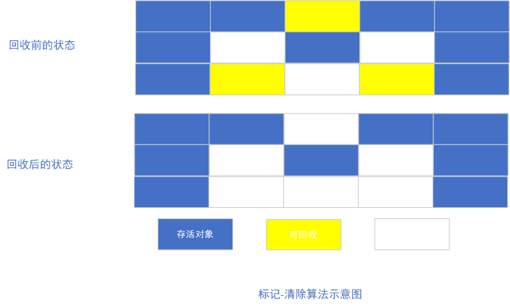
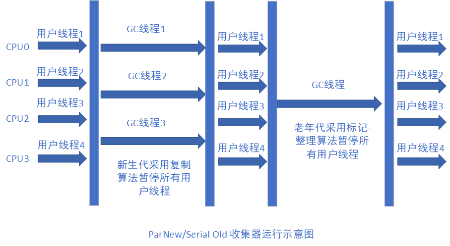

#### 概述

  GC（Garbage Collection，GC）诞生于1960年MIT的Lisp语言，经过半个多世纪的发展，内存的动态分配和内存回收技术已经相当成熟。JVM中，程序计数器、虚拟机栈、本地方法栈都是随线程而生随进程而灭，栈帧随着方法的进入和退出执行者进栈和出栈的动作，实现了内存的自动清理，因此，垃圾回收主要集中于java堆和方法区中，在程序运行期间，这部分内存的分配和使用都是动态的。

#### 对象存活判断

**引用计数**：每个对象都有一个引用计数属性，新增一个引用时计数加1，引用释放时计数减1，计数为0时可以回收。此方法简单，无法解决对象相互循环引用的问题。

可达性分析 （Reachability Analysis）：从GC Roots开始向下搜索，搜索所走过的路径称为引用链。当一个对象GC Roots没有任何引用链相连时，则证明此对象是不可用的。不可达对象。

在Java语言中，可作为GC Roots的对象包括以下几种：

* 虚拟机栈中引用的对象
* 方法区中类静态属性引用的对象
* 方法区中常量引用的对象
* 本地方法栈中JNI（即一般说的Native方法）引用的对象

#### 垃圾回收算法

##### 标记-清除算法

  最基础的算法是标记-清除（Mark-Sweep）算法，如同它的名字一样，算法分为标记和清除两个阶段：首先标记出所有需要回收的对象，在标记完成后统一回收所有被标记的对象。之所以说它是最基础的收集算法。是因为后续的收集算法都是基于这种思路并对其不足进行改进而得到的。

  它的主要不足有两个：一个是效率问题，标记和清除的效率都不高；另一个是空间问题，标记清除之后会产生大量不连续的内存碎片，空间碎片太多可能会导致以后在程序运行的过程中需要分配较大内存的对象时，无法找到足够的连续内存而不得不提前触发另一次垃圾收集的动作。

##### 复制算法

  为了解决效率问题，一种称为复制（copying）的收集算法出现了，它将可用内存按照容量划分为大小相等的两块，每次只使用其中的一块。当这一块用完了，就将还存活的对象复制到另外一块上，然后再把已使用的内存空间一次性清理掉。

  这样使得每次都是对整个半区进行内存回收，内存分配时也就不用考虑内存碎片等复杂情况，只要移动栈顶指针，按顺序分配内存即可，实现简单，内存高效。只是这种算法的代价是将内存缩小为了原来的一半，持续复制长生存期的对象则效率降低。

##### 标记-整理算法

  复制收集算法在对象存活率较高时就要进行较多的复制操作，效率将会变低。更关键的是，如果不想浪费50%的空间，就需要有额外的空间进行分配担保，以应对被使用的内存中所有对象都100%存活的极端情况，所以在老年代一般不能直接选用这种算法。

  根据老年代的特点，有人提出了另外一种标记-整理（Mark-Compact）算法，标记过程仍然与标记-清除算法一样，但后续操作不是直接对可回收对象进行清理，而是让所有存活的对象都一端移动，然后直接清理掉端边界以外的内存。

##### 分代收集算法

  当前商业虚拟机的垃圾收集都采用分代收集（Generational Collection）算法，这种算法并没有什么新的思想，只是根据对象存活周期的不同将内存划分为几块。一般是把Java堆分为新生代和老年代，这种就可以根据各个年代的特带你采用最适当的收集算法。在新生代中，每次垃圾收集时都发现有大批对象死去，只有少量存活，那就选用复制算法，只需要付出少量存活对象的复制成本就可以完成收集，而新老年代中对象存活效率高、没有额外的空间对它进行分配担保，就必须使用标记-整理或者标记-清理算法进行回收。

#### 垃圾收集器

  如果说垃圾算法是内存回收的方法论，那么垃圾收集器就是垃圾回收的具体实现。

##### Serial收集器

  Serial收集器是最基本、发展历史最悠久的收集器，它是一个单线程的收集器，单线程的意义并不仅仅说明它只会使用一个CPU或一条收集线程去完成垃圾收集工作，更重要的是在它进行垃圾收集时，必须暂停其它所有的工作线程，直到它收集结束。

##### ParNew收集器

  ParNew收集器其实就是Serial收集器的多线程版本，除了使用多条线程进行垃圾回收之外，其余行为包括Serial收集器可用的所有控制参数（例如:-XX:SurvivorRatio、-XX:PretenureSizeThreshold、-XX:HandlePromotionFailure等）、收集算法、Stop The World、对象分配原则、回收策略等都与Serial收集一致。其工作过程如下所示：

##### Parallel Scavenge

   Parallel Scavenge收集器是一个新生代收集器，它也是使用复制算法的收集器，Parallel ScaVenge更关注的是吞吐量（Throughput）。所谓吞吐量就是CPU用于运行用户代码的时间与CPU总消耗时间的比值，即吞吐量=运行用户代码时间/（运行用户代码时间+垃圾收集时间），其提供了两个参数用于精准控制吞吐量，分别是控制最大垃圾收集停顿时间的-XX:MaxGCPauseMillis参数以及直接设置吞吐量大小的-XX:GCTimeRatio参数。

##### CMS收集器

  CMS(Concurrent Mak Sweep)收集器是一种以获取最短回收停顿时间为目标的收集器。目前很大一部分的Java应用都集中在互联网站或B/S系统的服务端上，这类应用尤其重视服务的响应速度，希望系统停顿时间最短，以给用户带来最好的体验。它的过程分为4个步骤，包括：

* 初始标记（CMS initial mark）
* 并发标记（CMS concurrent mark）
* 重新标记（CMS remark）
* 并发清除（CMS concurrent sweep）

  其中初始标记、重新标记这两个步骤仍然需要Stop the world。初始标记仅仅只是标记一下GC Roots能直接关联到的对象，速度很快，并发阶段就是进行GC Roots Tracing的过程。而重新标记阶段则是为了修正并发标记期间，因用户程序继续运行而导致标记产生变动的那一部分对象的标记记录，这个阶段的停顿时间一般会比初始阶段稍长一些，但远比并发标记的时间短。

