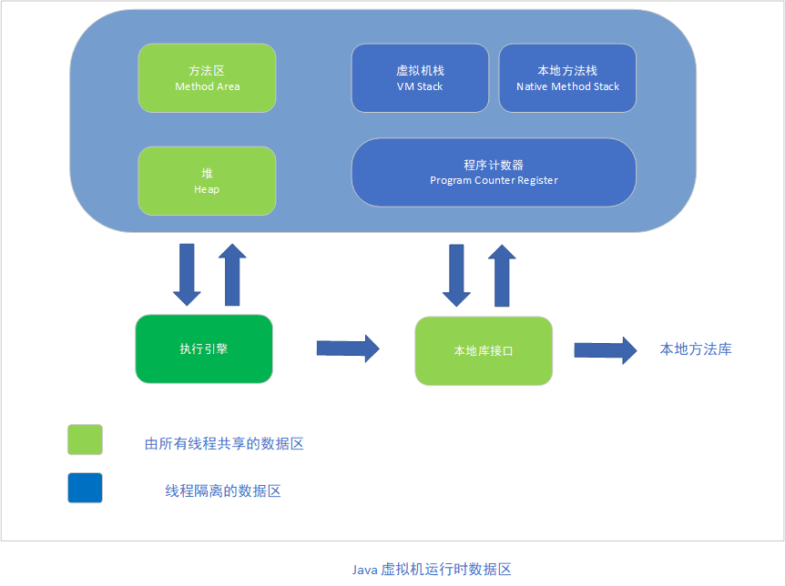

#### 运行时数据区域

  Java虚拟机所管理的内存将会包括以下几个运行时数据区域，如下所示：

##### 程序计数器

  程序计数器（Program Counter Register）是一块比较小的内存空间，它可以看作是当前线程所执行的字节码的行号指示器。

##### Java虚拟机栈

  与程序计数器一样，Java虚拟机栈（Java Virtual Machine Stacks）也是线程私有的，它的生命周期与线程相同。虚拟机栈描述的是Java方法执行的内存模型：每个方法在执行时都会创建一个栈帧（Stack Frame）用于存储局部变量表、操作数栈、动态链接、方法出口等信息。局部变量表存放了编译期可知的各种基本数据类型、对象引用（reference类型，它不等同于对象本身，可能是一个指向对象起始地址的引用指针，也可能是指向一个代表对象的句柄或其他与此对象相关的位置）。java虚拟机在此区域规定了两种异常情况：如果虚拟机栈在扩展时无法申请到足够的内存，就会抛出OutOfMemoryError异常。

##### 本地方法栈

  本地方法栈（Native Method Stack）与虚拟机栈所发挥的作用是非常相似的，他们的区别是虚拟机栈为虚拟机执行Java方法（也就是字节码服务），而本地方法栈则为虚拟机使用到的Native方法服务。

##### Java 堆

  Java堆（Java Heap）是Java虚拟机所管理的内存区域最大的一块，是被所有线程所共享的一块区域。此内存区域唯一的目的是存放对象实例，几乎所有的对象实例都在这里分配内存。Java 堆在物理上可以是不连续的，只要在逻辑上是连续的就可以。

##### 方法区

   方法区（Method Area）与Java堆一样，是各个线程共享的内存区域，它用于存储已被虚拟机加载的类信息、常量、静态变量、即时编译器编译后的代码等数据。